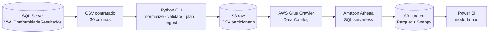

<div align="center">

# 🌊 Qualidade Ambiental AWS Data Lake

**Pipeline serverless e orientado por contrato para dados de qualidade da água e esgoto.**

*Do SQL Server ao Parquet, com validação local, catalogação no Glue, consultas no Athena e consumo no Power BI.*

---

[](https://github.com/engambientalucas-design/QualidadeAmbiental_AWS_DataLake/actions/workflows/ci.yml)
[](https://github.com/engambientalucas-design/QualidadeAmbiental_AWS_DataLake/releases)
[](https://www.python.org/)
[](https://aws.amazon.com/)
[](https://powerbi.microsoft.com/)
[](./LICENSE)

---

[Visão geral](#visão-geral) · [Arquitetura](#arquitetura) · [Instalação](#instalação) · [Uso](#uso) · [Roadmap](#roadmap)

</div>

---

## 📖 Visão geral

O **Qualidade Ambiental AWS Data Lake** é um projeto derivado do contrato externo de dados
v2.1.0 do [`QualidadeAmbiental_SQLServer`](https://github.com/engambientalucas-design/QualidadeAmbiental_SQLServer).
Ele recebe o CSV consolidado pela view `dbo.VW_ConformidadeResultados`, valida o contrato antes
de qualquer chamada à nuvem e prepara o lote para consumo analítico em uma arquitetura em camadas.

### Problema

Exportações analíticas podem chegar sem cabeçalho, conter `NULL` literal, quebrar tipos esperados,
duplicar resultados ou ser carregadas novamente na mesma partição. Sem controles explícitos, esses
problemas contaminam indicadores e tornam a origem dos dados difícil de auditar.

### Solução

O projeto implementa uma CLI Python que:

- normaliza exportações do SSMS para o contrato oficial de 30 colunas;
- valida tipos, datas ISO, decimais, nulos, unicidade e flags de conformidade;
- recusa partições raw ou curated preexistentes;
- envia o CSV para uma partição `ingestion_date` no Amazon S3;
- executa e acompanha o AWS Glue Crawler;
- compara contagens locais, raw e curated antes de concluir a carga;
- gera a transformação Athena para Parquet com compressão Snappy.

> **Status da v0.2.0:** a fundação AWS e a integração com Power BI permanecem validadas. Em `2026-06-23`, a CLI executou a primeira ingestão incremental automatizada usando uma identidade IAM dedicada. O lote apresentou 12 registros localmente, 12 registros na camada raw e 12 registros na camada curated em Parquet.

---

## 🏗️ Arquitetura



Uma única conta AWS e um único bucket podem hospedar os prefixos abaixo:

```text
s3://<bucket>/raw/dados_conformidade/ingestion_date=YYYY-MM-DD/
s3://<bucket>/curated/dados_conformidade/ingestion_date=YYYY-MM-DD/
s3://<bucket>/athena-results/
```

### Responsabilidades por camada

| Camada | Responsabilidade |
|---|---|
| SQL Server | Fonte oficial e classificação de conformidade |
| Python | Normalização, contrato, proteções e orquestração |
| S3 raw | Preservação do CSV contratado por data de ingestão |
| Glue | Descoberta de esquema e registro de partições |
| Athena | Validação SQL e transformação para a camada curated |
| S3 curated | Dados tipados em Parquet/Snappy |
| Power BI | Modelo semântico e visualização em modo Import |

---

## 🎬 Demonstração verificável

O lote didático versionado permite reproduzir a validação local sem credenciais AWS:

```powershell
$env:PYTHONPATH = "src"
python -m qa_datalake validate data\sample\dados_conformidade_v2_1_0.csv --baseline
```

Saída esperada:

```json
{
  "rows": 72,
  "columns": 30,
  "unique_samples": 6,
  "unique_parameters": 12,
  "with_limit": 57,
  "without_limit": 15,
  "conformant": 50,
  "non_conformant": 7
}
```

Os mesmos indicadores foram conferidos no Athena e no Power BI durante a validação da fundação AWS.

---

## ✨ Principais funcionalidades

- **Contrato antes da nuvem:** validação local ocorre antes de qualquer API AWS.
- **Normalização controlada:** adiciona o cabeçalho oficial e converte `NULL` literal em campo vazio.
- **Carga idempotente por rejeição:** uma partição existente bloqueia nova escrita.
- **Sincronização segura do crawler:** ignora o resultado anterior e aguarda a execução atual.
- **Gates de contagem:** CSV local, tabela raw e tabela curated devem apresentar o mesmo total.
- **SQL protegido:** nomes de banco e tabela passam por validação antes da geração das consultas.
- **Configuração externa:** nomes de recursos ficam no `.env`; credenciais permanecem fora do Git.
- **Testes sem nuvem:** a suite usa `unittest` e clientes simulados para validar a orquestração.

---

## 🔢 Baseline validado

| Indicador | Valor esperado |
|---|---:|
| Resultados analíticos | 72 |
| Resultados com limite de referência | 57 |
| Resultados sem limite de referência | 15 |
| Resultados conformes com limite | 50 |
| Resultados não conformes com limite | 7 |

O baseline é opcional e representa apenas o dataset didático v2.1.0. Novos lotes válidos podem
ter totais diferentes.

---

## 📋 Requisitos

### Para validação local

- Git;
- Python 3.11 ou superior.

### Para ingestão AWS

- AWS CLI configurado com uma identidade de ingestão não-root;
- `boto3` e `python-dotenv`, instalados pelo projeto;
- bucket S3 com os prefixos raw, curated e athena-results;
- Glue Crawler e bancos do Data Catalog existentes;
- tabela curated e workgroup Athena existentes;
- permissões mínimas para os recursos declarados no `.env`.

> A identidade restrita usada pelo Power BI não deve ser reutilizada para ingestão.

---

## 🚀 Instalação

### Windows PowerShell

```powershell
git clone https://github.com/engambientalucas-design/QualidadeAmbiental_AWS_DataLake.git
Set-Location QualidadeAmbiental_AWS_DataLake

py -m venv .venv
.venv\Scripts\Activate.ps1

python -m pip install --upgrade pip
pip install -e ".[dev]"

Copy-Item .env.example .env
```

### Linux ou macOS

```bash
git clone https://github.com/engambientalucas-design/QualidadeAmbiental_AWS_DataLake.git
cd QualidadeAmbiental_AWS_DataLake

python3 -m venv .venv
source .venv/bin/activate

python -m pip install --upgrade pip
pip install -e ".[dev]"

cp .env.example .env
```

---

## ⚙️ Configuração

Preencha o `.env` somente com nomes de recursos. Não inclua Access Key ID, Secret Access Key ou
Session Token nesse arquivo.

```dotenv
AWS_PROFILE=qa-datalake-ingestion
QA_AWS_REGION=us-east-1
QA_S3_BUCKET=replace-with-your-bucket-name
QA_RAW_PREFIX=raw/dados_conformidade
QA_GLUE_CRAWLER=qa-dados-conformidade-raw-crawler
QA_ATHENA_WORKGROUP=qa-qualidade-ambiental-wg
QA_RAW_DATABASE=qualidade_ambiental_raw
QA_RAW_TABLE=raw_dados_conformidade
QA_CURATED_DATABASE=qualidade_ambiental_curated
QA_CURATED_TABLE=dados_conformidade
QA_POLL_SECONDS=5
QA_TIMEOUT_SECONDS=600
```

As credenciais são resolvidas pela cadeia padrão do AWS SDK. Para desenvolvimento local, prefira
um perfil AWS CLI baseado em IAM Identity Center ou outra forma de credencial temporária.

---

## 💻 Uso

### Normalizar uma exportacao do SSMS

Use quando o arquivo não tiver cabeçalho ou contiver `NULL` literal:

```powershell
qa-datalake normalize data\input\export_ssms.csv data\output\dados_conformidade.csv
```

### Validar localmente

```powershell
qa-datalake validate data\output\dados_conformidade.csv
```

Para exigir os totais do lote didático:

```powershell
qa-datalake validate data\sample\dados_conformidade_v2_1_0.csv --baseline
```

### Visualizar o plano sem acessar a AWS

```powershell
qa-datalake plan data\output\dados_conformidade.csv --ingestion-date 2026-07-01
```

### Ingerir um novo lote

```powershell
qa-datalake ingest data\output\dados_conformidade.csv --ingestion-date 2026-07-01
```

> ⚠️ Não execute o lote de amostra contra `2026-06-22`: essa partição já existe no ambiente usado
> para validar a fundação AWS e será corretamente rejeitada.

O procedimento operacional e as regras de recuperação estão no
[`docs/runbook.md`](./docs/runbook.md).

---

## 🧪 Testes

### Windows PowerShell

```powershell
$env:PYTHONPATH = "src"
python -m unittest discover -s tests -v
```

### Linux ou macOS

```bash
PYTHONPATH=src python -m unittest discover -s tests -v
```

A suite atual possui 13 testes para contrato CSV, normalização, SQL Athena, sincronização do
crawler, orquestração simulada e baseline versionado. O mesmo comando é executado pelo GitHub
Actions em pushes e pull requests.

---

## 🗂️ Estrutura do repositório

```text
QualidadeAmbiental_AWS_DataLake/
├── .github/
│   └── workflows/
│       └── ci.yml
├── data/
│   └── sample/
│       └── dados_conformidade_v2_1_0.csv
├── docs/
│   ├── adr/
│   │   └── 0001-separate-derived-project.md
│   ├── iam/
│   │   ├── README.md
│   │   └── *.template.json
│   └── runbook.md
├── src/
│   └── qa_datalake/
├── tests/
├── .env.example
├── .gitignore
├── CHANGELOG.md
├── LICENSE
├── pyproject.toml
└── README.md
```

---

## 🛠️ Stack

| Tecnologia | Uso no projeto |
|---|---|
|  | CLI, validação de contrato e orquestração |
|  | Integração com APIs AWS |
|  | Zonas raw e curated, além de resultados Athena |
|  | Crawler e Data Catalog |
|  | Validação SQL e transformação serverless |
|  | Formato colunar e compressão da camada curated |
|  | Consumo analítico em modo Import |
|  | Testes automatizados em push e pull request |

---

## 🛡️ Segurança e custos

- Nunca use a conta root para executar a CLI de ingestão.
- Não versione `.env`, perfis AWS, arquivos de credenciais ou resultados Athena.
- Use uma identidade de ingestão separada da identidade de leitura do Power BI.
- Mantenha o crawler sem agendamento enquanto o volume for didático.
- Use filtros de partição nas consultas Athena.
- Mantenha limite de bytes por consulta no workgroup.
- AWS Budgets envia alertas, mas não interrompe gastos automaticamente.

---

## 🗺️ Roadmap

Consulte as [GitHub Issues](https://github.com/engambientalucas-design/QualidadeAmbiental_AWS_DataLake/issues)
para acompanhar a evolução.

- [x] Fundação S3, Glue, Athena e Power BI validada manualmente
- [x] Contrato CSV de 30 colunas e baseline reproduzivel
- [x] Normalização de exportacao SSMS
- [x] Orquestrador Python com proteção contra duplicidade
- [x] Testes automatizados locais
- [x] Identidade IAM dedicada para ingestão Python
- [x] Primeira execução automatizada de um novo lote na AWS
- [x] Workflow de CI versionado no repositório
- [x] Primeira execução bem-sucedida do GitHub Actions
- [ ] Infraestrutura como código com Terraform ou AWS CDK
- [ ] Monitoramento operacional no CloudWatch
- [ ] Políticas de ciclo de vida para resultados Athena
- [ ] Template Power BI distribuível

---

## 🤝 Contribuição

Contribuições são bem-vindas quando preservam o contrato de dados e as proteções contra escrita
duplicada.

1. Crie um fork do repositório.
2. Abra uma branch a partir de `main`.
3. Implemente a alteração com testes correspondentes.
4. Execute a suite localmente.
5. Abra um pull request descrevendo motivação, impacto e evidências.

Para bugs ou propostas de evolução, abra uma
[issue](https://github.com/engambientalucas-design/QualidadeAmbiental_AWS_DataLake/issues).

---

## 📌 Decisões e limitações

- O SQL Server permanece a fonte oficial da regra de conformidade.
- Este projeto consome o contrato; ele não recalcula a regra ambiental.
- Os limites e resultados do dataset são didáticos e não constituem enquadramento legal.
- Substituição destrutiva de partições permanece fora do escopo da v0.2.0.
- O motivo para manter este projeto separado está documentado no
  [`ADR 0001`](./docs/adr/0001-separate-derived-project.md).

---

## 📄 Licença

Distribuído sob a [licença MIT](./LICENSE).

---

<div align="center">

**Lucas Prado Siqueira**  
Engenharia Ambiental & Engenharia de Dados

[](https://github.com/engambientalucas-design)

</div>
